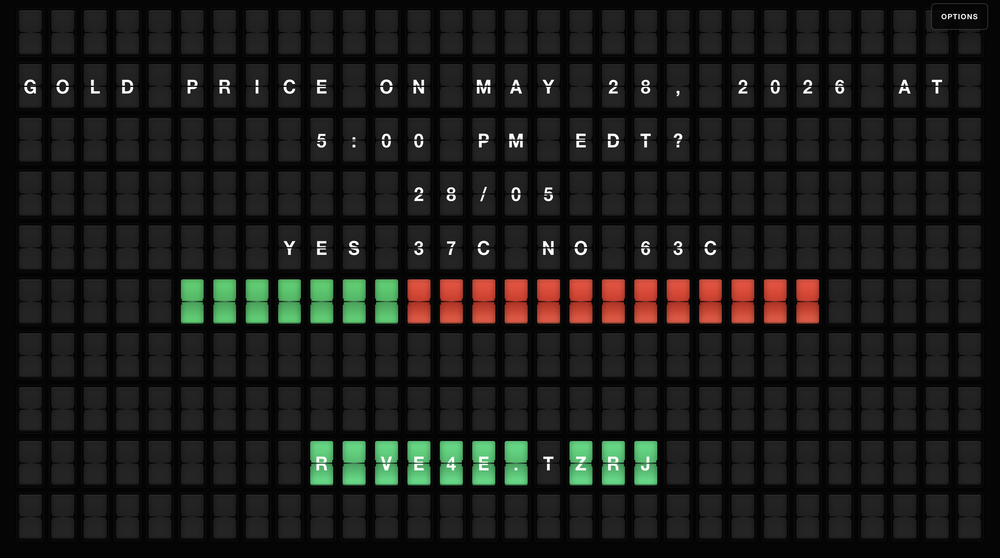

# KalshiBoardScreensaver

**A macOS split-flap screen saver for live Kalshi markets.**

KalshiBoardScreensaver turns open Kalshi binary markets into a fullscreen market board. It fetches live market data from Kalshi, ranks markets by 24-hour volume and total volume, and rotates through the strongest matches with the exact API-provided market/event title, expiration date, YES/NO prices, probability bar, and main category.



## Features

- Live top-volume Kalshi binary market rotation
- Exact Kalshi API titles and option labels
- YES/NO midpoint pricing and visual probability bar
- Expiration date displayed as `DD/MM`
- Main category display, with optional category and competition filtering
- Fullscreen TV mode
- Split-flap tile animation with embedded transition audio
- Small local Node server that serves static files and proxies Kalshi API calls
- Vanilla HTML/CSS/JS with no package install step
- Branded macOS DMG with preview image, volume icon, and installer background

## Quick Start

Run the local server from this folder:

```bash
node server.mjs
```

Then open:

```text
http://127.0.0.1:4173/
```

If that port is already in use:

```bash
PORT=4174 node server.mjs
```

The server is required for live Kalshi data because the browser calls `/api/kalshi/...`, and `server.mjs` proxies those requests to Kalshi's public API.

## Controls

| Control | Action |
| --- | --- |
| Gear button | Open settings |
| Board size | Choose Dense, Balanced, or Large Text |
| Background | Choose Dark or Light |
| Category | Filter to one main Kalshi category |
| Subcategory | Filter by the selected category's competition/league |
| Fullscreen button or `F` | Toggle fullscreen |
| Sound button or `M` | Toggle transition audio |
| `Escape` | Exit fullscreen |

## macOS Screen Saver

The native macOS screen saver embeds the same web app in `WKWebView`, serves the bundled app locally, and proxies Kalshi API paths from inside the screen saver.

Build the screen saver and DMG:

```bash
scripts/build-screensaver.sh
```

The branded installer is written to:

```text
dist/KalshiBoardScreensaver.dmg
```

Generated build files are written to `build/` and `dist/`, which are intentionally ignored by Git.

## Release Package

The DMG contains:

- `KalshiBoard.saver`
- install notes
- custom installer background from `thumbnail.png`
- Kalshi volume icon from `kalshi.png`
- bundled preview/brand assets from `macos-screensaver/Packaging/Assets/`

## How It Works

`server.mjs` serves the app and proxies supported Kalshi endpoints under `/api/kalshi`. `js/KalshiFeed.js` fetches open binary markets, enriches them with event and series metadata, sorts them by 24-hour volume first and total volume second, then builds a tile frame for each market. The board engine renders those frames with split-flap animations and colored YES/NO bar tiles.

The macOS screen saver uses `macos-screensaver/Sources/KalshiBoardSaverView.swift` to load the same web app from bundled resources and proxy the same Kalshi API paths from inside WebKit.

## File Structure

```text
.
  index.html              Single-page app shell
  server.mjs              Static server and Kalshi API proxy
  scripts/
    build-screensaver.sh  Build a .saver bundle and DMG
  macos-screensaver/
    Info.plist            Screen saver bundle metadata
    Sources/              Swift ScreenSaverView and WebKit bridge
    Packaging/            DMG install notes and release assets
  css/
    reset.css             CSS reset
    layout.css            App shell and settings panel
    board.css             Fullscreen board grid
    tile.css              Split-flap tile styling and YES/NO tones
    responsive.css        Large-screen and fullscreen adjustments
  js/
    main.js               App bootstrap and settings wiring
    KalshiFeed.js         Market fetch, ranking, and frame formatting
    Board.js              Grid manager and transition orchestration
    Tile.js               Individual tile animation logic
    SoundEngine.js        Embedded transition audio playback
    KeyboardController.js Fullscreen and sound keyboard shortcuts
    constants.js          Grid, timing, and animation constants
    flapAudio.js          Embedded audio data
```

## Legacy Cleanup Notes

The original FlipOff quote rotator has been removed from the active app. The old `MessageRotator.js`, quote message constants, quote interval constant, and unused accent color list are no longer needed because KalshiBoard now drives the display from `KalshiFeed.js`.

The reusable pieces from the original app are still valuable: the board renderer, tile animation, sound engine, keyboard fullscreen/mute handling, base CSS reset, and embedded flap audio.

## License

MIT
